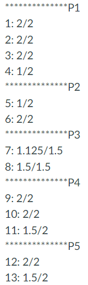
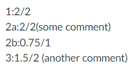
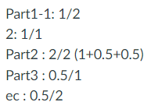

# GradeAdder
Examples:\
1.
 \
add_grades(25, ec=1, q_num=14) \
get result 21.62 
2.
 \
add_grades(7, ec=0, index=[1,'2a','2b', 3]) \
ger result 6.25 
3.
 \
add_grades(6, ec=2, index=['Part1-1', '2', 'Part2', "Part3", "ec"]) \
get result 5.0
